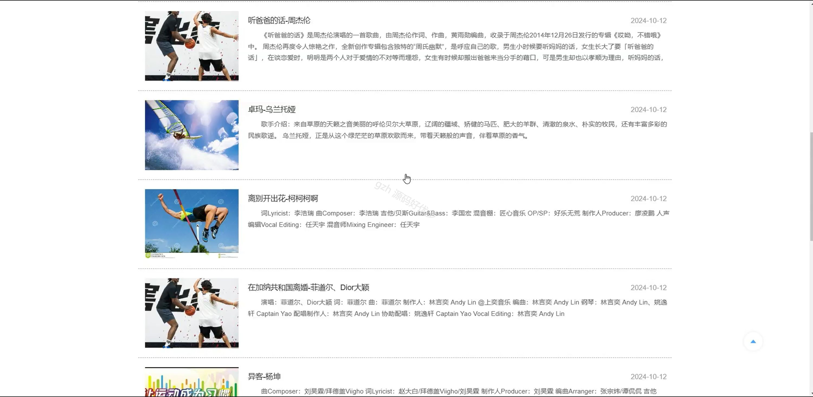
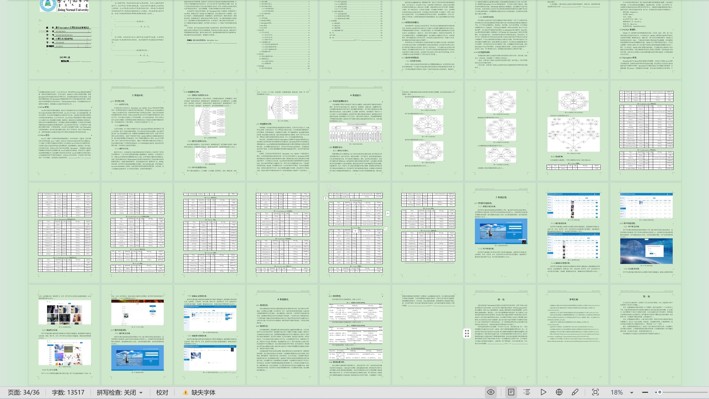

# springbootA511D
springbootA511D高校运动会管理系统
## 查看主页获取源码

### 一、关键词

赛事记录管理、赛事报名、赛事物品管理

### 二、作品包含

源码+数据库+设计文档万字+全套环境和工具资源+部署教程

### 三、项目技术

前端技术：Html、Css、Js、Vue3.0、Element-plus
后端技术：Java、SpringBoot3.0、MyBatis

### 四、运行环境（以下版本亲测，其他版本未知，请自测）

开发工具：IDEA/eclipse  + VSCODE

数据库：MySQL5.7（最低要5.7版本）

数据库管理工具：Navicat10以上版本

环境配置软件： jdk17 + Maven3.6.3

前端Nodejs：20

浏览器：谷歌浏览器

### 五、项目介绍

项目编号：springbootA511D

高校运动会管理系统通过数字化手段，实现运动会全流程信息化管理，提升组织效率，确保信息准确及时，为运动员、观众提供良好体验，还能为学校提供数据支持以优化体育资源和赛事规划，推动校园体育活动现代化。

角色：管理员、用户、裁判

管理员：登录、首页、系统公告、比赛情况查看、轮播图、新闻资讯、赛事记录管理、赛事报名、赛事物品管理、赛事信息管理、用户管理。

用户：注册、登录、首页、运动器材、运动服装、新闻资讯、场地、赛事信息、系统公告、个人中心、修改密码、比赛情况查看、赛事记录管理、奖品。

裁判：注册、登录、首页、系统公告、赛事报名、赛事记录管理、赛事信息。

### 六、运行截图

